# AthenaGen – Human-in-the-Loop Review (HIL)

## 🚀 Quick Start

```bash
# 1. Δημιουργία virtual environment
python -m venv .venv
# Windows
.venv\Scripts\activate
# macOS / Linux
source .venv/bin/activate

# 2. Εγκατάσταση πακέτων
pip install -r requirements.txt

# 3. Εκκίνηση UI
streamlit run app.py
```

💡 Σε Windows μπορείς απλά να κάνεις **διπλό κλικ στο `run.bat`** για αυτόματη εκκίνηση.

---

## 📄 Περιγραφή

Εφαρμογή **Streamlit** για ενοποίηση, οπτικοποίηση και επαλήθευση δεδομένων από **φόρμες**, **emails** και **τιμολόγια HTML**, με δυνατότητα διόρθωσης και εξαγωγής βάσει προκαθορισμένου CSV template.

---

## 🎯 Στόχοι

* Συγκέντρωση διαφορετικών πηγών (`forms`, `emails`, `invoices`) σε ένα ενιαίο feed.
* Άνθρωπος-στο-βρόχο (**HIL**): επιβεβαίωση, διόρθωση, έγκριση/απόρριψη.
* Export σε CSV/Excel με headers του template του project.

---

## ✨ Βασικά Χαρακτηριστικά

* 📥 **Rebuild feed**: τρέχει parsers και ανανεώνει `outputs/combined_feed.json`.
* 🔎 **Φίλτρα & αναζήτηση** στο sidebar.
* 📨 **Emails**: προεπισκόπηση plain & HTML, ανίχνευση invoice number.
* 🧾 **Τιμολόγια HTML**: προβολή πωλητή/πελάτη/ημερομηνίας/γραμμών.
* ✏️ **Inline edit** γραμμών με υπολογισμούς (subtotal/ΦΠΑ/σύνολο).
* ✅ **Approve / Reject** με αλλαγή status.
* 📝 **Σημειώσεις** ανά εγγραφή.
* 📤 **Exports (CSV/Excel)** βάσει `dummy_data/templates/data_extraction_template.csv`.
* 🧰 **Backup & Log viewer**.

---

## 🛠 Τεχνολογίες

* **Python** 3.11+
* **Streamlit** 1.48
* **pandas**, **openpyxl**
* **BeautifulSoup4**, **lxml**
* **altair**, **pydeck**

---

## 🖥 Εκκίνηση (Windows)

1. Βεβαιώσου ότι έχεις **Python 3.11+**.
2. Διπλό κλικ στο **`run.bat`**.
3. Εκκινεί αυτόματα το UI στο [http://localhost:8501](http://localhost:8501).

---

## 🔄 Ροή Χρήσης

1. **Rebuild feed** από το sidebar → “🔄 Τρέξε parsers & ανανέωσε δεδομένα”.
2. **Φίλτρα**:

   * Source: form, email, invoice\_html
   * Status: pending, approved, rejected, edited
   * Needs action
3. **Προβολή λεπτομερειών**:

   * Emails: plain/HTML σώμα, ανίχνευση invoice number.
   * Τιμολόγια: εκδότης/πελάτης, ημερομηνία, γραμμές, υπολογισμοί.
4. **Status & Notes**:

   * Approve/Reject, προσθήκη σημειώσεων.
5. **Export**:

   * CSV (UTF-8 BOM) ή Excel, με σειρά/στήλες από το template.

---

## 📂 Δομή Φακέλων

```
automation_project/
├─ app.py
├─ run.bat
├─ requirements.txt / requirements.lock.txt
├─ dummy_data/
│  ├─ forms/
│  ├─ emails/
│  ├─ invoices/
│  └─ templates/
│     └─ data_extraction_template.csv
├─ outputs/
│  ├─ combined_feed.json
│  ├─ _backups/
│  └─ log.txt
├─ exports/
└─ screenshots/
   ├─ dashboard.png
   ├─ sidebar.png
   ├─ sidebar_2.png
   ├─ sidebar_3.png
   ├─ sidebar_4.png
   ├─ sidebar_5.png
   ├─ invoice.png
   ├─ invoice_2.png
   ├─ invoice_3.png
   ├─ email.png
   ├─ status.png
   └─ log.png
```

---

## 📷 Screenshots

### Dashboard – Κεντρική οθόνη

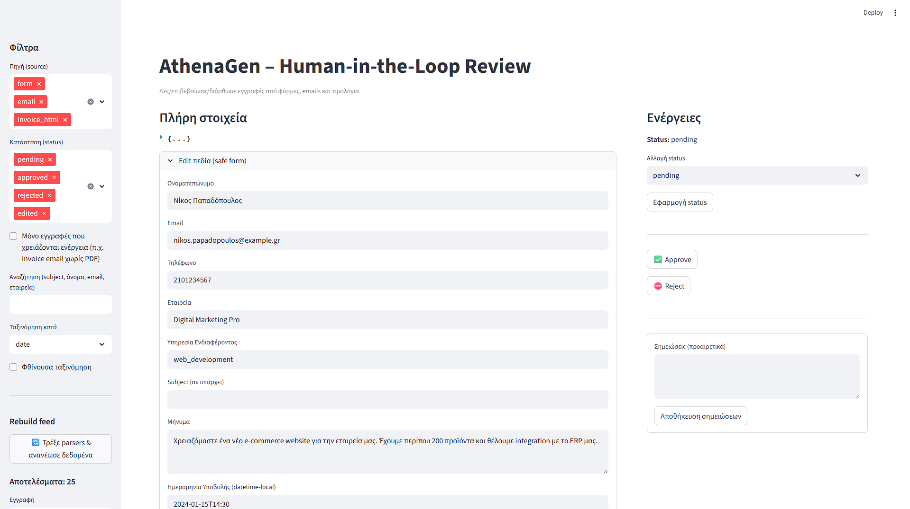

### Φίλτρα (Sidebar)

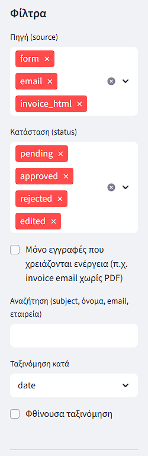

### Rebuild Feed

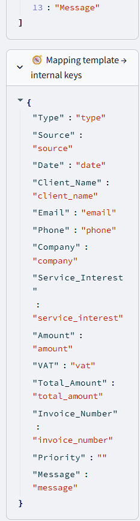

### Επιλογή Εγγραφής

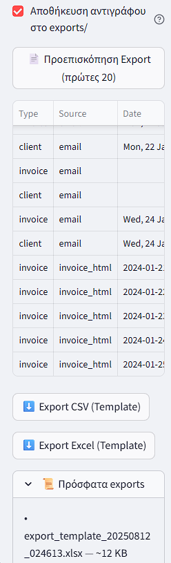

### Περιεχόμενο Email (Plain Text)

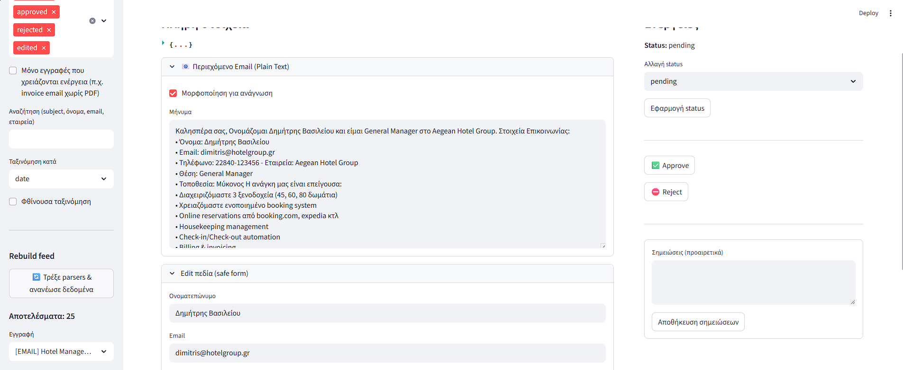

### Προεπισκόπηση Τιμολογίου (Parsed)

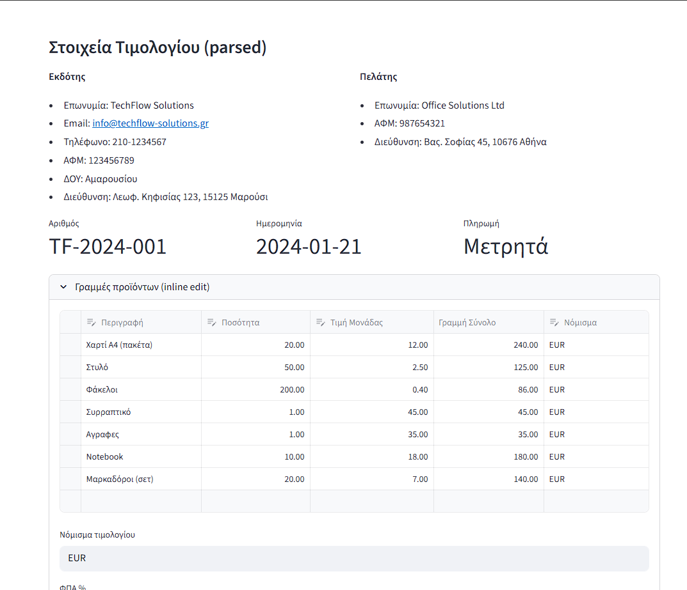

### Προεπισκόπηση Τιμολογίου (HTML)

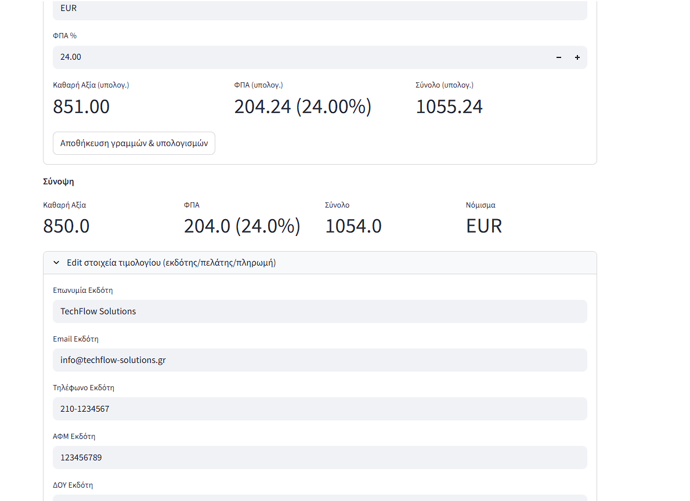

### Στοιχεία Τιμολογίου & Inline Υπολογισμοί

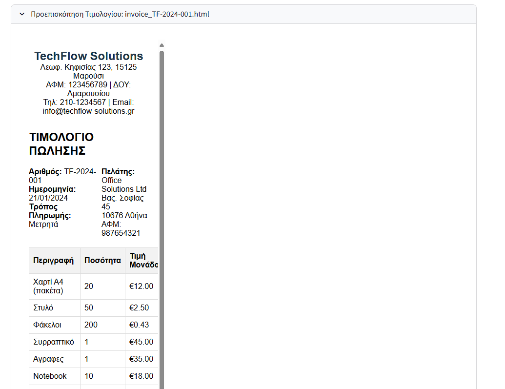

### Mapping Template

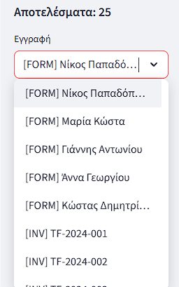

### Προεπισκόπηση Export

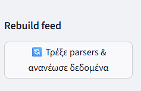

### Ενέργειες – Αλλαγή Status

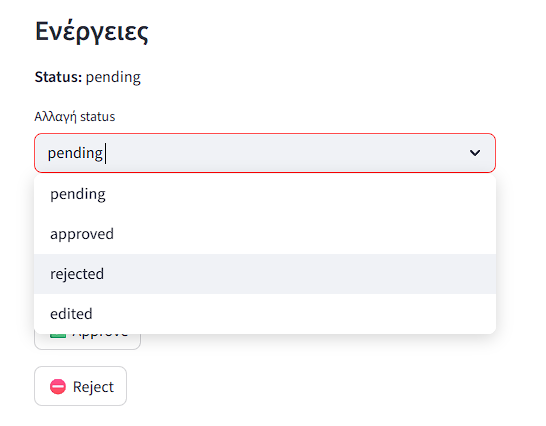

### Log Viewer

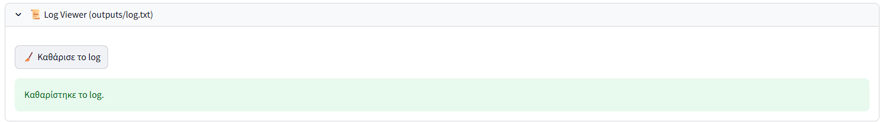

---

## 🛠 Troubleshooting

* **Κενά στο export**: Έλεγξε template CSV και headers.
* **Δεν φορτώνει data**: Πάτησε Rebuild feed.
* **Σπασμένα ελληνικά**: Χρησιμοποίησε UTF-8 BOM (utf-8-sig).

---

## 📌 Roadmap

* Google Sheets export.
* Αυτόματη αποθήκευση exports.
* PDF invoice parser.
* Data validation πριν το export.

---
